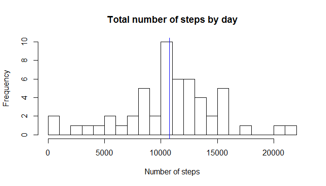
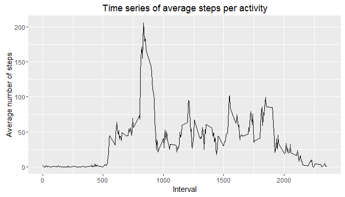
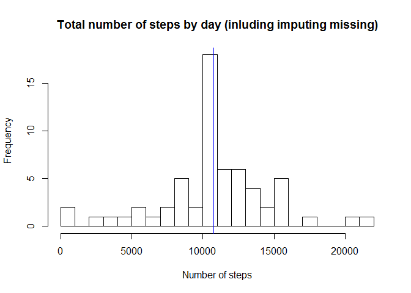
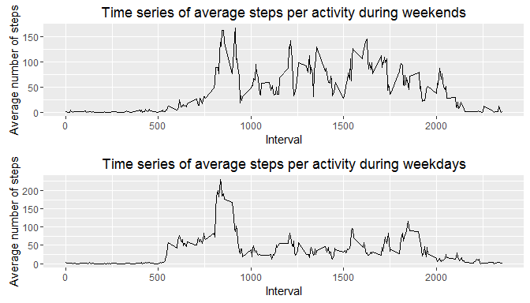

# Reproducible Research: Peer Assessment 1


## Loading and preprocessing the data


```r
library(ggplot2)
```

```
## Warning: package 'ggplot2' was built under R version 3.2.4
```

```r
library(sqldf)
```

```
## Loading required package: gsubfn
```

```
## Loading required package: proto
```

```
## Loading required package: RSQLite
```

```
## Loading required package: DBI
```

```r
library(gridExtra)
```

```
## Warning: package 'gridExtra' was built under R version 3.2.5
```

```r
activities <- read.csv("activity.csv");

head(activities)
```

```
##   steps       date interval
## 1    NA 2012-10-01        0
## 2    NA 2012-10-01        5
## 3    NA 2012-10-01       10
## 4    NA 2012-10-01       15
## 5    NA 2012-10-01       20
## 6    NA 2012-10-01       25
```

## What is mean total number of steps taken per day?


```r
dailyTotalSteps <- sqldf("SELECT date, sum(steps) as totalSteps, avg(steps) as avgSteps from activities where steps != 'NA' group by date")
```

```
## Loading required package: tcltk
```

```r
head(dailyTotalSteps)
```

```
##         date totalSteps avgSteps
## 1 2012-10-02        126  0.43750
## 2 2012-10-03      11352 39.41667
## 3 2012-10-04      12116 42.06944
## 4 2012-10-05      13294 46.15972
## 5 2012-10-06      15420 53.54167
## 6 2012-10-07      11015 38.24653
```


```r
hist(dailyTotalSteps$totalSteps, breaks = 30, xlab = "Number of steps", main = "Total number of steps by day")
abline(v = mean(dailyTotalSteps$totalSteps), col = "blue", lwd = 1)
```



## What is the average daily activity pattern?


```r
dailyAverageSteps <- sqldf("SELECT interval, avg(steps) as avgSteps from activities where steps != 'NA' group by interval")
```

```r
qplot(interval, avgSteps, data=dailyAverageSteps, geom="line", main="Time series of average steps per activity", xlab = "Interval", ylab = "Average number of steps")
```



## Imputing missing values


```r
cleanedActivities <- activities
for (row in 1:nrow(cleanedActivities)) {
	if (is.na(cleanedActivities[row,"steps"])) {
		cleanedActivities[row,"steps"] <- dailyAverageSteps$avgSteps[dailyAverageSteps$interval == cleanedActivities[row,"interval"]]
	}else{
		cleanedActivities[row,"steps"] <- cleanedActivities[row,"steps"]
	}
}

head(cleanedActivities)
```

```
##       steps       date interval
## 1 1.7169811 2012-10-01        0
## 2 0.3396226 2012-10-01        5
## 3 0.1320755 2012-10-01       10
## 4 0.1509434 2012-10-01       15
## 5 0.0754717 2012-10-01       20
## 6 2.0943396 2012-10-01       25
```


```r
dailyTotalCleanedSteps <- sqldf("SELECT date, sum(steps) as totalSteps, avg(steps) as avgSteps from cleanedActivities where steps != 'NA' group by date")

hist(dailyTotalCleanedSteps$totalSteps, breaks = 30, xlab = "Number of steps", main = "Total number of steps by day (inluding imputing missing)")
abline(v = mean(dailyTotalCleanedSteps$totalSteps), col = "blue", lwd = 1)
```



## Are there differences in activity patterns between weekdays and weekends?


```r
cleanedActivities$weekday <- as.factor(ifelse(weekdays(as.Date(as.character(cleanedActivities$date))) %in% 
                                    c("Saturday","Sunday"),"weekend", "weekday"))

weekend <- sqldf("SELECT interval, avg(steps) as avgSteps, weekday
    FROM cleanedActivities
    WHERE weekday = 'weekend'
      GROUP BY weekday, interval
      ORDER BY interval")
      
weekday <- sqldf("SELECT interval, avg(steps) as avgSteps, weekday
    FROM cleanedActivities
    WHERE weekday = 'weekday'
      GROUP BY weekday, interval
      ORDER BY interval")

head(weekend)
```

```
##   interval    avgSteps weekday
## 1        0 0.214622642 weekend
## 2        5 0.042452830 weekend
## 3       10 0.016509434 weekend
## 4       15 0.018867925 weekend
## 5       20 0.009433962 weekend
## 6       25 3.511792453 weekend
```

```r
head(weekday)
```

```
##   interval   avgSteps weekday
## 1        0 2.25115304 weekday
## 2        5 0.44528302 weekday
## 3       10 0.17316562 weekday
## 4       15 0.19790356 weekday
## 5       20 0.09895178 weekday
## 6       25 1.59035639 weekday
```


```r
plot1 <- qplot(interval, avgSteps, data=weekend, geom="line", main="Time series of average steps per activity during weekends", xlab = "Interval", ylab = "Average number of steps")

plot2 <- qplot(interval, avgSteps, data=weekday, geom="line", main="Time series of average steps per activity during weekdays", xlab = "Interval", ylab = "Average number of steps")

grid.arrange(plot1, plot2)
```


